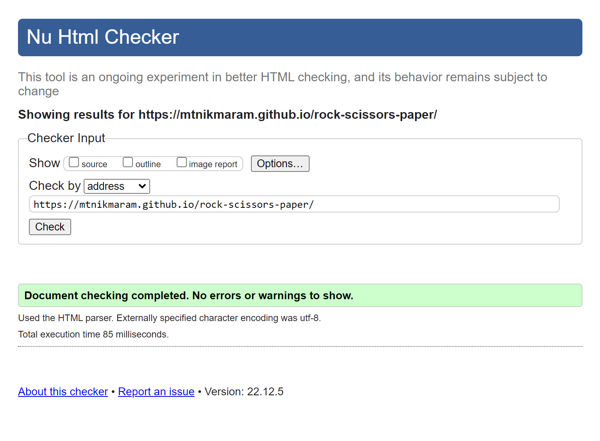

# PAPER-ROCK-SCISSORS   

This is a paper rock scissors game made by Html ,Css & JavaScript.
 <a href="https://mtnikmaram.github.io/rock-scissors-paper/" target="_blank" rel="noopener">paper rock scissors</a>
 

# contents

* [**Features**](<#features>)
  * [Header](<#header>)
  * [player choices](<#player-choices>)
  * [The Game results](<#the-game-results>)
* [**Future Features**](<#future-features>)
* [**Technologies Used**](<#technologies-used>)
* [**Testing**](<#testing>)
  * [lighthouse](<#lighthouse>)
  * [HTML and CSS Validation](<#html-and-css-validation>)
  * [Responsiveness Test](<#responsiveness-test>)
  * [Browser Compatibility](<#browser-compatibility>)
* [**Deployment**](<#deployment>)
* [**Bugs**](<#bugs>)
* [**credits**](<#credits>)
* [**Acknowledgements**](<#acknowledgements>)

## Header

* In the top section you can see the header links 
* This header clearly tells the user what game they are playing  

## player choices 

* In this section you can select which choice you want to make .

## The Game Results
* when the user clicks an option, the image relating to their choice is shown on their side of the game board.
* The javaScript code chooses a random option for the computer player. displayes the image relating to the computer determines who the winner is .
* The winner gets the score and the score is updated each time.

## Future Features
* I will try to add the "you win " and "you lose " to the game.

# Technologies Used
* [HTML5](https://html.spec.whatwg.org/) - provides the content and structure for the website.
* [CSS](https://www.w3.org/Style/CSS/Overview.en.html) - provides the styling.
* [js](https://www.w3schools.com/js/)- provides the javaScript.
* [Github](https://github.com/) - used to host and edit the website.

## Testing
* I tested the game in different browsers: Chrome , Firefox, Safari.
* I have checked that the result are always correct.

# Lighthouse

Lighthouse is a feature of Google Chrome developer tools and is used to assess the performance of the website and its features.

# HTML and CSS Validation

After fixing some errors and also some unnecessary sections in index.html or style elements in style.css , the site eventually passed the W3C Validation.

# Responsiveness Test

* The responsive design tests were carried out manually with [Google Chrome DevTools](https://developer.chrome.com/docs/devtools/) and [Responsive Design Checker](https://www.responsivedesignchecker.com/).

|        | Galaxy S5 | iPhone 5 | iPad |  Display <1200px | Display >1200px |
|--------|-----------|----------|------|------------------|-----------------|
| Render | pass      | pass     | pass | pass             | pass            |
| Links  | pass      | pass     | pass | pass             | pass            |
| Images | pass      | pass     | pass | pass             | pass            |

# Browser Compatibility

paper-rock-scissors site was tested on the following browsers with no visible issues for the user. 
Google Chrome and Mozilla Firefox. All the features was great.

## Deployment

### **To deploy the project**
The site was deployed to GitHub pages. The steps to deploy a site are as follows:
  1. In the GitHub repository, navigate to the **Settings** tab.
  2. Once in Settings, navigate to the **Pages** tab on the left hand side.
  3. Under **Source**, select the branch to **master**, then click **save**.
  4. Once the master branch has been selected, the page will be automatically refreshed with a detailed ribbon display to indicate the successful deployment.

  The live link to the Github repository can be found here - https://mtnikmaram.github.io/rock-scissors-paper/

### **To create a local clone of this project**
The method from cloning a project from GitHub is below:

1. Under the repository’s name, click on the **code** tab.
2. In the **Clone with HTTPS** section, click on the clipboard icon to copy the given URL.

3. In your IDE of choice, open **Git Bash**.
4. Change the current working directory to the location where you want the cloned directory to be made.
5. Type **git clone**, and then paste the URL copied from GitHub.
6. Press **enter** and the local clone will be created.

## Bugs
* the big bug was the image size and the display in other screen size.
## credits
* The font came from [Google Fonts](https://fonts.google.com/).
* The icons came from [Font Awesome](https://fontawesome.com/).
* The form validation idea came from a [YouTube tutorial](https://www.youtube.com/watch?v=fNcJuPIZ2WE).

# Acknowledgements
The site was completed as a Portfolio 1 Project piece for the Full Stack Software Developer (e-Commerce) Diploma at the [Code Institute](https://codeinstitute.net/). As such I would like to thank my mentor [Precious Ijege](https://www.linkedin.com/in/precious-ijege-908a00168/), the Slack community, and all at the Code Institute for their help and support. 
